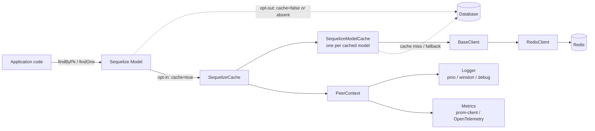
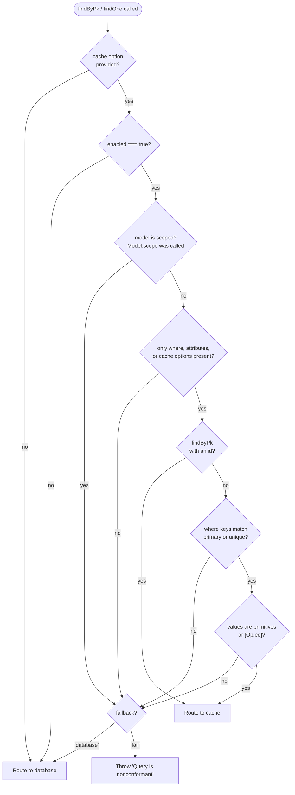
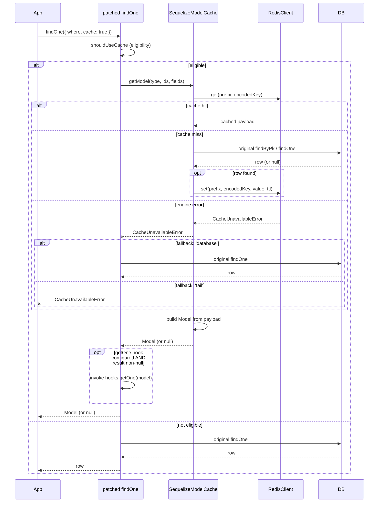
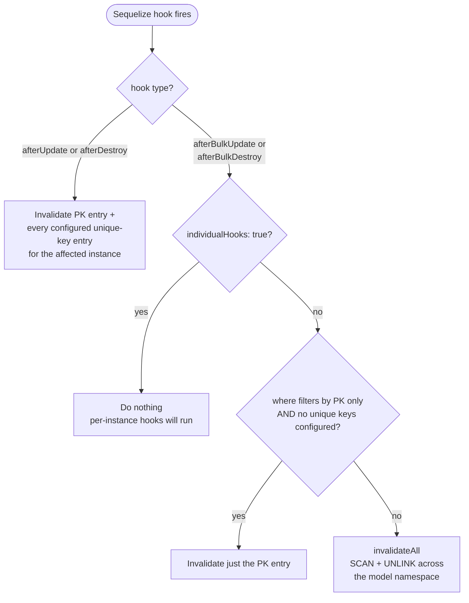

# Architecture

This document describes how `sequelize-model-cache` operates: how it integrates with Sequelize, how queries are routed between cache and database, what invalidation does and does not guarantee, and where the sharp edges are.

The intended audience is primarily **operators** running an application that uses the library — people who need to reason about latency, consistency, failure modes, and the impact of schema changes — but it also serves as an onboarding document for **contributors**. References to internals are included where they meaningfully change operational behavior.

For planned work that is not yet implemented, see [ROADMAP.md](ROADMAP.md).

## Goals

- **Transparent.** Applications opt in per query. Without `cache: true`, every method behaves exactly as vanilla Sequelize.
- **Safe.** Cache failures must never break the application or roll back a database transaction. Invalidation errors are swallowed; read errors fall back to the database unless the caller explicitly opts into failure.
- **Observable.** Every routing decision and engine operation surfaces logs and metrics, so operators can see hit rates, hydration cost, and error patterns without instrumenting the library themselves.
- **Model-layer.** The cache deals in Sequelize model instances, not raw rows or arbitrary query results. Hydration goes through the model's normal read path; results are returned as fully-built `Model` instances.

The library does **not** attempt to provide strong consistency between the database and the cache. This is intrinsic to caching: a cache hit reflects the world as of some earlier write, and concurrent writers can race with invalidation. Callers that need strict read-after-write semantics must either disable caching for the affected paths or invalidate explicitly.

## Component Overview

- **`SequelizeCache`** ([lib/SequelizeCache.ts](lib/SequelizeCache.ts)) is the public entry point. Calling `cacheModel(Model, options)` patches the model in place to enable caching.
- **`SequelizeModelCache`** ([lib/SequelizeModelCache.ts](lib/SequelizeModelCache.ts)) is created once per cached model and owns the model's key schema, type-coercion mapping, TTL, and a single engine client whose metric prefix is scoped to that model.
- **`BaseClient` / `RedisClient`** ([lib/engines/](lib/engines/)) abstract the cache engine. The engine is selected at construction time based on `engine.type`.
- **`PeerContext`** ([lib/peers.ts](lib/peers.ts)) resolves the optional logger and metrics provider from whichever peer dependencies the host application has installed.

There is no global registry. Each `SequelizeCache` instance has its own `PeerContext`, so multiple instances configured with different metrics or loggers can coexist in the same process. However, `cacheModel` registration is global to the model class (see [Operational Considerations](#operational-considerations)).

## How Queries Are Routed

When `cacheModel(Model, options)` is called, the library:

1. Verifies the model has not been registered before (a second call throws `AlreadyCachedError`).
2. Constructs a `CachedModelInstance` for the model.
3. Replaces `Model.findByPk` and `Model.findOne` with wrappers that decide between cache and database.
4. Registers `afterUpdate`, `afterDestroy`, `afterBulkUpdate`, and `afterBulkDestroy` hooks for invalidation.

The original `findByPk` / `findOne` are captured in closure so the wrappers can fall back to them. All other Sequelize methods are untouched.

### Eligibility

Whether a given call uses the cache is decided by `shouldUseCache`. The full decision is:

Operationally, this means:

- `include`, `order`, `limit`, `group`, `transaction`, `lock`, `paranoid`, and any other Sequelize option disqualifies the query.
- `Op.gt`, `Op.in`, `Op.like`, etc. all disqualify. Only bare values and `{ [Op.eq]: ... }` are accepted.
- `Model.scope(...)` returns a copy with `scoped === true`, which the cache treats as a different (uncached) class. This is currently a hard limit; see [ROADMAP.md](ROADMAP.md#scoped-model-support) for planned work.
- `attributes` is **permitted but ignored**. The cache always stores and returns the full row regardless of which attributes the caller requested. Code that depends on `attributes` filtering should not enable caching for that query.

### Cached `findOne` Path

An important thing to note is that, in the event an instance needs to be hydrated, the hydration path will load the model from the database _outside_ of any open transaction on the current path. This is an intentional design decision, as the cached model must represent the current view of the database, not changes that have not yet been persisted. If the transaction later modifies this record, the `afterUpdate` hook will fire and invalidate the cached record.

Another important point is that the cache operates on a best-effort basis. If Redis is unable to be reached during hydration, the failure will be logged and tracked via metrics but will pass through to the database (unless explicitly marked with a `fail` fallback method). The cache will not be hydrated in this case; the next request will attempt to populate the cache again.

## Cache Key Encoding

Every cached value is keyed by an encoded identifier composed from the model's primary key or a configured unique-key group. The encoding lives in [lib/SequelizeModelCache.ts](lib/SequelizeModelCache.ts) and uses two separator tokens:

- `KEY_SEPARATOR = '»key»'`
- `VALUE_SEPARATOR = '§val§'`

| Lookup                            | Encoded form                                        |
| --------------------------------- | --------------------------------------------------- |
| Primary key, single column        | `pk§val§<value>`                                    |
| Primary key, composite            | `pk»key»<col>§val§<value>»key»<col>§val§<value>...` |
| Unique key (always carries names) | `uq»key»<col>§val§<value>»key»<col>§val§<value>...` |

Field order is normalized by sorting column names, so `findOne({ where: { a, b } })` and `findOne({ where: { b, a } })` resolve to the same key. The full Redis key is then `<namespace>:<modelName>:<encoded>`, where `namespace` defaults to `modelcache`.

A consequence of the current encoding: looking up the same row by primary key and by a unique key produces two independent cache entries with no linkage. They will hydrate independently and invalidate independently. This is by design today but is the first item on the [ROADMAP](ROADMAP.md#cache-key-deduplication-pointeralias-keys), since pointer-style keys would deduplicate storage and simplify several downstream features.

## Invalidation

Invalidation is driven entirely by Sequelize lifecycle hooks installed at `cacheModel` time. The library never proactively scans for stale data.

The branches matter operationally:

- **Per-instance hooks** are precise: every cache key the instance could be addressed by is deleted in a single batched call.
- **Bulk operations on a model with any configured unique keys flush the entire model namespace.** This ensures accuracy of the cache (the library does not have access to the affected instances and cannot determine which unique-key entries to delete) but can be expensive on large keyspaces. If per-row cost is acceptable, set `individualHooks: true` on the bulk operation; the library will then defer to per-instance hooks. Otherwise, design the bulk operation to filter on the primary key against a model with no unique keys, which the library can invalidate precisely.
- **`invalidateAll` walks the namespace** with `SCAN` + `UNLINK` in batches of 100, capped at 10,000 iterations. If the cap is hit, a warning is logged and stale entries remain. See [ROADMAP.md](ROADMAP.md#improve-invalidateall-strategy) for a planned generation/version-prefix approach that would make this O(1).

**Invalidation is best-effort.** All engine error paths in `del`, `delMany`, and `delAll` are caught, logged, and converted to a metric increment. The hook handlers also wrap the call in `try/catch` for defense in depth. The contract is: **an invalidation failure cannot roll back the database transaction that triggered it.** The trade-off is that a cache entry can be stale until its TTL expires (default of one hour). It is recommended not to use caching where this level of best-effort is not acceptable.

## Time-to-Live

TTL is set once when the value is hydrated and is **not refreshed on subsequent hits**. A hot key still expires on its original schedule and triggers a hydration miss when it does. The default is 3600 seconds (1 hour); per-model overrides are configured via `ttl` on `cacheModel`. TTL refresh is on the [roadmap](ROADMAP.md#ttl-refresh-on-cache-hit).

## Type Coercion

The cache round-trips through JSON, which loses type information. To preserve fidelity, `SequelizeModelCache` builds a column-name → converter mapping based on the model's declared `DataTypes`:

| Sequelize type                  | Converter                         |
| ------------------------------- | --------------------------------- |
| `BIGINT`                        | `BigInt(...)`                     |
| `BOOLEAN`                       | `Boolean(...)`                    |
| `INTEGER` / `FLOAT` / `DECIMAL` | `Number(...)`                     |
| `DATE` / `DATEONLY` / `TIME`    | `new Date(...)`                   |
| `VIRTUAL` / `JSON` / `JSONB`    | identity (driver-dependent shape) |
| `BIT(...)`                      | `Buffer.from(value.data)`         |
| anything else                   | `String(...)`                     |
| `null` / `undefined`            | passed through unchanged          |

`JSON` and `JSONB` are intentionally not normalized because dialects disagree (`pg` returns parsed objects; `mariadb` returns raw strings). Applications consuming JSON columns through the cache will see the same shape they would see from a direct Sequelize read against that dialect. `BigInt` is also serialized to its string form on write because `JSON.stringify` does not handle `BigInt` natively.

`VIRTUAL` columns are not part of the cached payload (Sequelize excludes them from the row data the library stores). In practice, this is not an issue, as virtual columns are computed programmatically based on how other non-virtual fields are populated or other logic. This logic will still function with records hydrated by the cache.

## Engine Abstraction

`BaseClient` ([lib/engines/EngineClient.ts](lib/engines/EngineClient.ts)) defines the surface every engine must implement: `set`, `get`, `del`, `delMany`, `delAll`. Only `RedisClient` is currently implemented; memcached support is on the [roadmap](ROADMAP.md#memcached-support).

A few engine-level invariants matter for operators:

- **Only `get` throws.** Every other engine operation catches errors, logs them, and increments `cache_operation_error`. This is what makes writes and invalidations best-effort by construction.
- **`get` throws `CacheUnavailableError`.** The findByPk/findOne wrappers catch this specifically and consult the per-query `fallback` setting.
- **Serialization is JSON-based and currently not pluggable.** A pluggable serializer is on the [roadmap](ROADMAP.md#configurable-serialization).

## Configuration and Peer Resolution

The `PeerContext` resolves optional logging and metrics peers at `SequelizeCache` construction time:

- **Logger.** If `logger` is provided, it is wrapped to adapt to either Pino or Winston. Otherwise the library tries to load `debug` and use it under the namespace `sequelize-cache`. If `debug` is not installed, logging is a no-op.
- **Metrics.** If `metrics` is provided, the resolver duck-types the object: a `registerMetric` method indicates Prometheus, a `createCounter` method indicates OpenTelemetry. Otherwise metrics are no-ops.

All metric definitions are eagerly created at construction so callers do not need to handle a missing-metric case anywhere in the code paths.

## Operational Considerations

A few sharp edges that follow directly from the design:

- **`cacheModel` is global to the model class.** Because it patches the static `findByPk` and `findOne`, every Sequelize connection that uses that class is affected. The library's `WeakSet` guard rejects double-registration to make this explicit.
- **TTL is not refreshed on hit.** Frequently-read keys expire on the same schedule as cold ones. If a particular key needs to stay hot, raise the TTL. The library does not implement sliding expiration today.
- **Schema changes are not detected.** The cached payload reflects the columns that existed at cache time. Adding a column and rolling out the new code will leave existing entries in the cache without that column until they expire or are invalidated. For breaking schema changes, invalidate the existing cache records using `invalidateAll()`. This will be solved more gracefully with generational caching.
- **Hydration races.** Two concurrent misses for the same key both run the database query and both write to the engine. Writes are idempotent for unchanged data, but a write between the two reads can be overwritten. The library does not use SETNX or distributed locks today; cache-stampede protection is on the [roadmap](ROADMAP.md#cache-stampede-protection).
- **Transactional reads.** Hydration does not participate in the caller's transaction. Reads inside a transaction that depend on uncommitted data should not enable the cache.
- **Bulk invalidation is coarse on models with unique keys.** As discussed in the [Invalidation](#invalidation) section, this can flush the entire model namespace. Plan bulk operations accordingly.

## Error Surface

| Error                     | Origin                                               | When the caller sees it                  |
| ------------------------- | ---------------------------------------------------- | ---------------------------------------- |
| `CacheUnavailableError`   | `RedisClient.get` on engine failure                  | Only when `cache.fallback === 'fail'`    |
| `AlreadyCachedError`      | `cacheModel` on a model already registered           | Always — programmer error, fail-fast     |
| `UnsupportedEngineError`  | `createEngineClient` for an unrecognized engine type | Always — configuration error, fail-fast  |
| `NonconformantQueryError` | `shouldUseCache` rejecting a query in `'fail'` mode  | Only when the caller opted into `'fail'` |

## Testing

The repository separates **unit tests** ([unit/](unit/)) from **integration tests** ([test/](test/)). Unit tests stub the engine and exercise routing, encoding, and hook logic in isolation. Integration tests stand up a real Redis and a real database via [docker-compose.yaml](docker-compose.yaml) to verify end-to-end behavior, including type coercion across dialects, expiration, lifecycle invalidation, and fallback under engine failure. The `npm run test:integration:docker` script handles bringing the supporting containers up and tearing them down.
